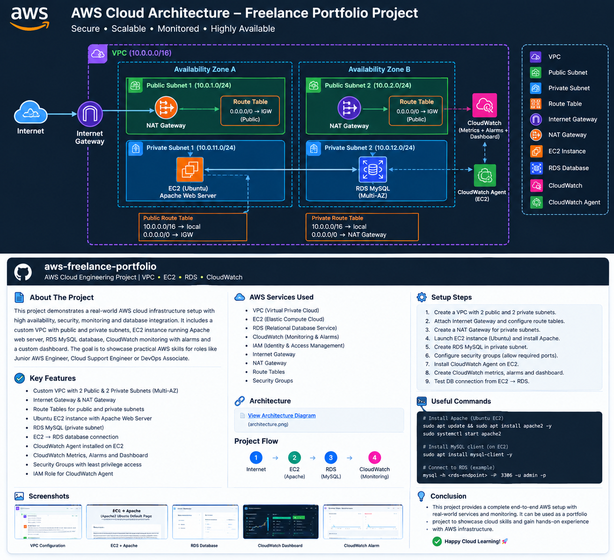

# AWS Cloud Infrastructure & Monitoring project 

## 📌 Project Overview

This project demonstrates a practical AWS cloud infrastructure setup using Amazon VPC, EC2, RDS and CloudWatch.

The infrastructure includes public and private subnets, Internet Gateway, NAT Gateway, Ubuntu EC2 with Apache Web Server, private RDS MySQL database and CloudWatch monitoring.

## ☁️ AWS Services Used

- Amazon VPC
- Amazon EC2
- Amazon RDS MySQL
- Amazon CloudWatch
- CloudWatch Agent
- AWS IAM
- Internet Gateway
- NAT Gateway
- Route Tables
- Security Groups

## 🏗️ Architecture



## 🔧 Infrastructure Configuration

### VPC

- VPC CIDR: `10.0.0.0/16`
- 2 Public Subnets
- 2 Private Subnets
- Multiple Availability Zones

### EC2

- Operating System: Ubuntu
- Web Server: Apache
- HTTP Port: `80`
- SSH Port: `22`

### RDS

- Database Engine: MySQL
- Database: `freelance_db`
- Port: `3306`
- Public Access: Disabled
- RDS deployed in private subnets

### CloudWatch

- Memory Monitoring
- Disk Monitoring
- CloudWatch Dashboard
- CloudWatch Alarms

## 🛠️ Implementation Steps

1. Created a custom VPC.
2. Created 2 public and 2 private subnets.
3. Configured Internet Gateway and route tables.
4. Created NAT Gateway for private subnet access.
5. Launched Ubuntu EC2 instance.
6. Installed Apache Web Server.
7. Created private RDS MySQL database.
8. Configured Security Groups.
9. Connected EC2 to RDS successfully.
10. Created database and users table.
11. Installed CloudWatch Agent on EC2.
12. Created CloudWatch Dashboard and Alarms.

## 💻 Apache Installation

```bash
sudo apt update
sudo apt install apache2 -y
sudo systemctl start apache2
sudo systemctl enable apache2
